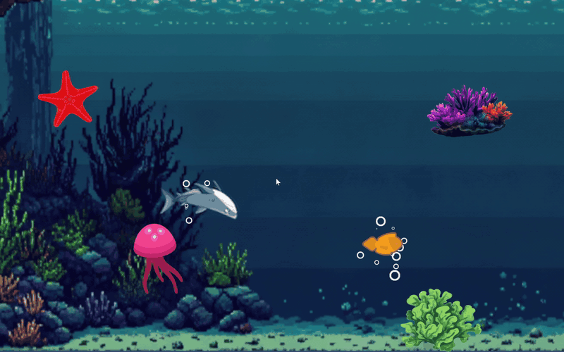
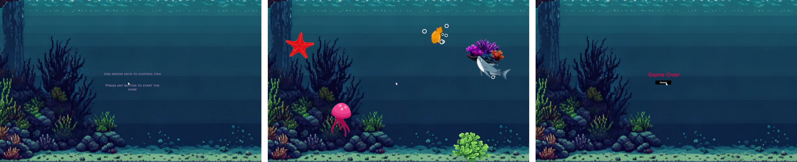
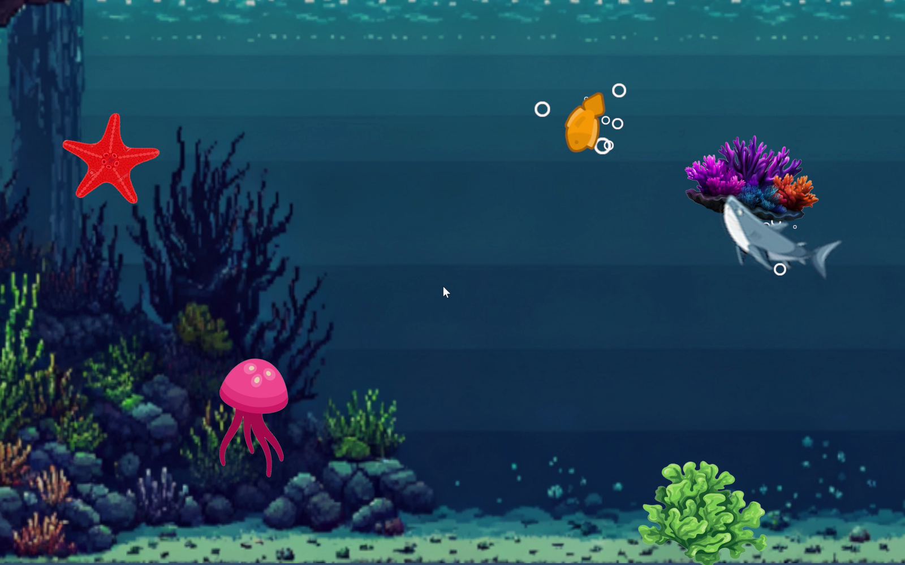
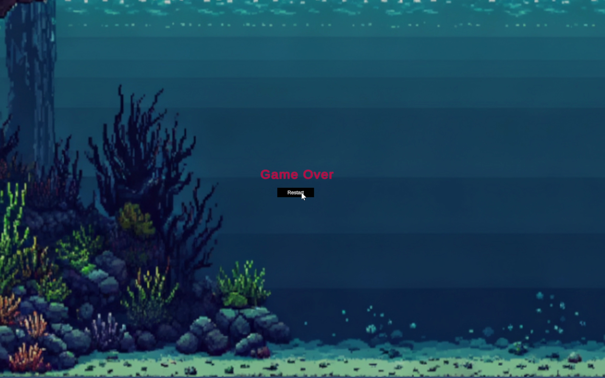

# 🐟 Fish Vs Shark 🦈

> A fast-paced 2D survival game built with Unity and C#, where you control a small fish, navigate an underwater environment, and try to survive while being relentlessly pursued by a shark.

<p align="center">
  
</p>

<p align="center">
  
  
  
  
</p>

---

## About the Game

**Fish Vs Shark** is a small 2D survival game developed in **Unity using C#**.

The player controls a fish moving through an underwater environment while a shark continuously pursues it. The objective is simple:

> **Keep moving, navigate around obstacles, and avoid being caught by the shark for as long as possible.**

Although intentionally simple in scope, the project brings together several fundamental game-development concepts including player movement, 2D physics, collision handling, enemy pursuit behaviour, particle effects, audio, camera feedback and game-state management.

---

## 🎮 Gameplay

The game follows a simple survival loop:

```text
Start Screen
     ↓
Start Game
     ↓
Control the Fish
     ↓
Navigate Around Obstacles
     ↓
Shark Pursues the Player
     ↓
Survive as Long as Possible
     ↓
Shark Catches Fish
     ↓
Game Over
     ↓
Restart
```

<p align="center">
  
</p>

The shark continuously tracks the player's position, forcing the player to keep moving and use the environment to stay out of reach.

---

## 🎬 Full Gameplay Demo

A recorded gameplay demo shows the complete game loop in action, including movement, obstacle navigation, shark pursuit, collision effects, game audio and the game-over sequence.

<p align="center">
  <a href="docs/media/fish-vs-shark-gameplay-demo.mp4">
    
  </a>
</p>

<p align="center">
  <strong>▶ Click the preview above to watch the gameplay demo with audio</strong>
</p>

The animated preview at the top of this README provides a quick look at the gameplay, while the full recording preserves the original sound and complete gameplay sequence.

---

## 🕹️ Controls

Player movement is handled through directional keyboard input.

| Input | Action |
|:---:|---|
| **W / ↑** | Move Up |
| **S / ↓** | Move Down |
| **A / ←** | Move Left |
| **D / →** | Move Right |
| **Any Key** | Start the game |
| **Restart Button** | Restart after Game Over |

The fish also rotates according to its movement direction, allowing the character sprite to visually respond to changes in player input.

---

## 🦈 Shark Pursuit

The shark is the primary threat and the central mechanic of the game.

Rather than following a fixed animation or predefined route, the shark continuously calculates the direction towards the player's current position and moves towards it.

Conceptually:

```text
Player Position
      │
      ▼
Calculate Direction
      │
      ▼
Normalise Movement Vector
      │
      ▼
Move Shark Toward Player
      │
      ▼
Repeat Continuously
```

<p align="center">
  
</p>

This creates a continuous chase in which the player's movement directly influences the shark's behaviour.

---

## ⚙️ Gameplay Systems

Several small systems work together to create the complete gameplay loop.

### Player Movement

The fish responds to directional input and moves through the 2D environment.

Movement logic also controls the orientation of the fish so its sprite responds naturally when the player changes direction.

### Physics & Obstacles

The environment contains obstacles that interact with the moving characters.

The game uses Unity's **2D physics and collision systems** to manage interactions between the fish, shark and environment.

### Enemy Behaviour

The shark continuously pursues the player's current position, providing a simple real-time enemy behaviour system.

### Collision Detection

Collision between the shark and fish triggers the end of the current run and activates the corresponding game-over effects.

### Game State

The game manages the transition between several states:

```text
Waiting to Start
       ↓
     Playing
       ↓
    Collision
       ↓
    Game Over
       ↓
     Restart
```

This coordinates gameplay, UI and effects across the complete game loop.

---

## 💥 Game Over & Player Feedback

Being caught by the shark triggers more than a simple scene transition.

The game combines several effects to make the collision immediately noticeable:

- Shark/fish collision detection
- Game-over state
- Camera shake
- Bubble/particle effects
- Sound effects
- Game-over interface
- Restart functionality

<p align="center">
  
</p>

These effects provide visual and audio feedback while clearly signalling that the current run has ended.

---

## 🌊 Environment & Presentation

The underwater scene includes additional movement and presentation effects to prevent the environment from feeling completely static.

The project includes:

- Environmental sway
- Bobbing movement
- Water movement
- Background music
- Gameplay sound effects
- Particle effects
- Camera feedback
- UI transitions

Background music is also managed separately so that audio behaves appropriately throughout the game flow.

---

## 🧠 Technical Highlights

The project demonstrates practical use of several Unity and C# concepts:

```text
Unity 2D
│
├── C# Gameplay Scripts
│
├── Player Input
│
├── Rigidbody2D Physics
│
├── Collision Detection
│
├── Vector-Based Movement
│
├── Enemy Pursuit
│
├── Sprite Rotation
│
├── Coroutines
│
├── Particle Systems
│
├── Camera Effects
│
├── Audio Management
│
├── UI & Game States
│
└── Scene Management
```

---

## 🛠️ Built With

| Technology | Purpose |
|---|---|
| **Unity 6000.1.7f1** | Game engine |
| **C#** | Gameplay programming |
| **Unity 2D Physics** | Movement and collision behaviour |
| **Rigidbody2D** | Physics-based object interaction |
| **Particle System** | Visual feedback and effects |
| **Unity Audio** | Background music and sound effects |
| **Unity UI** | Start and game-over interfaces |

---

## 📁 Project Structure

The repository contains the original Unity project together with media used to document the finished game.

```text
Fish-Vs-Shark/
│
├── Assets/
│   ├── Scripts/
│   ├── Scenes/
│   ├── Sprites/
│   ├── Audio/
│   └── ...
│
├── Packages/
│
├── ProjectSettings/
│
├── docs/
│   ├── screenshots/
│   │   ├── 01-start-screen.png
│   │   ├── 02-gameplay.png
│   │   ├── 03-game-over.png
│   │   └── 04-gameplay-flow.png
│   │
│   └── media/
│       ├── gameplay-preview.gif
│       └── fish-vs-shark-gameplay-demo.mp4
│
├── .gitignore
└── README.md
```

> Unity-generated temporary directories and other regeneratable artefacts can be excluded from version control.

---

## ▶️ Running the Project

### Open in Unity

1. Clone or download the repository.
2. Open **Unity Hub**.
3. Select **Add project from disk**.
4. Select the cloned project directory.
5. Open the project using a compatible Unity version.
6. Open the main game scene.
7. Press **Play**.

The project was developed using:

```text
Unity 6000.1.7f1
```

Opening the project with a substantially different Unity version may trigger an upgrade or compatibility process.

---

## 🪟 Windows Build

The game was also built as a standalone **Windows application**, allowing it to run independently of the Unity Editor.

A typical Unity Windows build contains the executable together with its associated data files and Unity runtime components.

For portfolio distribution, a packaged Windows build can be provided separately through **GitHub Releases**, keeping compiled binaries separate from the main source repository.

---

## 💡 What I Learned

This project provided practical experience in connecting several individual game-development systems into a complete playable loop.

In particular, it helped develop understanding of:

- Translating keyboard input into player movement
- Working with Unity's 2D physics system
- Using vectors for enemy pursuit
- Responding to collisions through C#
- Coordinating gameplay and UI states
- Adding visual and audio feedback
- Using particle effects and camera movement to improve game feel
- Managing game-over and restart behaviour
- Building a standalone Windows version of a Unity project

While mechanically simple, the project demonstrates the relationship between:

**Input → Movement → Physics → Enemy Behaviour → Collision → Feedback → Game State**

---

## 🚀 Possible Improvements

If the game were expanded further, possible additions could include:

- Survival timer and high-score system
- Increasing difficulty over time
- Progressive shark speed
- Multiple sharks
- Collectable items
- Power-ups
- Player health or multiple lives
- Additional obstacle types
- Difficulty levels
- Improved enemy pathfinding
- Pause functionality
- Main menu and settings
- Persistent high scores
- Additional underwater environments

These additions could expand the simple survival loop while preserving the original chase-focused gameplay.

---

## 📌 Project Context

**Fish Vs Shark** was developed as a small 2D game project focused on learning and applying core Unity game-development concepts.

It is preserved as part of my development portfolio to demonstrate practical experience with:

**Unity • C# • 2D Physics • Collision Systems • Enemy Behaviour • Gameplay Programming • Audio • Particle Effects**

The project is intentionally small in scope, but represents a complete playable game rather than an isolated technical prototype.

---

## Status

**Completed**

A playable 2D Unity survival game with a complete:

```text
Start → Play → Pursuit → Collision → Game Over → Restart
```

gameplay loop.

---
